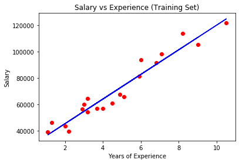
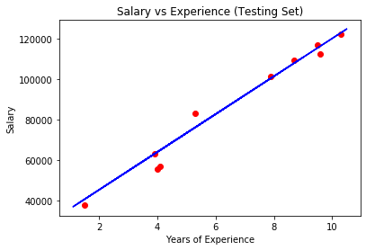

# Salary Predicting Model 

This is a simple Salary Predicting Model based on Linear Regression and the predicting feature is the amount of experience that the employee has the Model been trained on the Salary given to the past workers.

## Visualizing Model

* Salary vs Experience (Training Set)

* Salary vs Experience (Testing Set)

